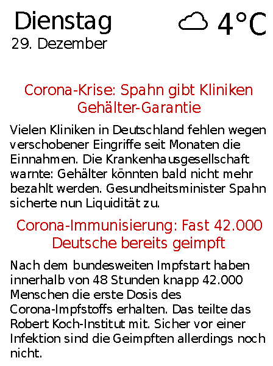

# news-pi

A program to display weather info from openweathermap.com and news from tagesschau.de.



## General
The display is refreshed after a few minutes.
In the night the display is cleared to avoid burn in.
Up to two news messages are displayed, the first one being the newest available and the second switching between older messages.
Currently only the 648×480, 5.83inch, red/black/white epaper display by waveshare is supported.
Everything is displayed in German. 
Temperature is in Celsius.

## Usage
Plug in your display and write the config.
Launch the "show.py" script, preferably in the background as it contains an infinite loop.
The script "clear.py" can be used to clear the screen.

## Config
A "config.json" file of the following form is required.
```
    "open_weather": {"key": <api-key>, "location": <location>},
    "birthdays": {
        "Taylor Swift": "12-13"
    },
    "events": {
        "05-04": "May the force be with you"
    }
   
```
The values for events replace the second line of the date e.g. "May the fourth be with you" instead of "04. Mai". 
Birthday wishes are displayed below the date and weather info.
